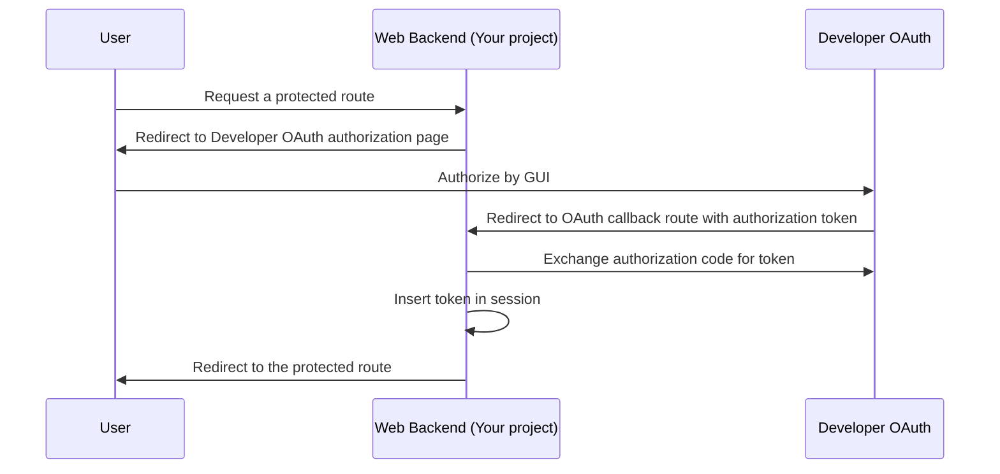

# @sl-nest-module/dev-oauth-web

This module provide the OAuth flow logic required to integrate with Shopline [Developer Center](https://shopline-developers.readme.io/docs/get-started). This should only be used in a [NestJS](https://docs.nestjs.com/) web backend project. Also note that session is required to use this project.

## Installation

```sh
yarn add @sl-nest-module/dev-oauth-web
```

## Usage

### Registering Module

`DeveloperOAuthModule` provided 2 methods to register: `forRoot` and `forRootAsync`. Once imported in your root module, `DeveloperOAuthModule` will add an API route specified by the `callbackPath` option, which will process the OAuth callback from the Developer OAuth server. For more details on the callback path, see [How it works](#how-it-works).

```typescript
import { DeveloperOAuthModule } from '@sl-nest-module/dev-oauth-web';

// Example 1: forRoot

@Module({
  imports: [
    /* Other Modules */
    DeveloperOAuthModule.forRoot({
      host: process.env.DEVELOPER_OAUTH_OAUTH_HOST,
      appId: process.env.DEVELOPER_OAUTH_APP_ID,
      appSecret: process.env.DEVELOPER_OAUTH_APP_SECRET,
      scope: process.env.DEVELOPER_OAUTH_SCOPE,
      redirectUri: process.env.DEVELOPER_OAUTH_REDIRECT_URI,
      ensureLoginSession: process.env.DEVELOPER_OAUTH_ENSURE_LOGIN_SESSION,
      callbackPath: 'oauth',
    }),
  ],
})
export class RootModule {}

// Example 2: forRootAsync

@Module({
  imports: [
    /* Other Modules */
    DeveloperOAuthModule.forRootAsync({
      useFactory: (config: ConfigService) => {
        return {
          host: config.developerApp.host,
          appId: config.developerApp.id,
          appSecret: config.developerApp.secret,
          scope: config.developerApp.scope,
          redirectUri: config.developerApp.redirectUri,
          ensureLoginSession: config.developerApp.ensureLoginSession,
          callbackPath: 'oauth',
        };
      },
      inject: [ConfigService],
    }),
  ],
})
export class RootModule {}
```

---

### Protecting routes with OAuth

To protect routes with OAuth authentication, apply `DeveloperOAuthMiddleware`.

For different ways to apply middleware in NestJS, see [here](https://docs.nestjs.com/middleware#applying-middleware). Please be careful not to apply the middleware to the OAuth callback path, which may result in an infinite redirection.

```typescript
import { DeveloperOAuthMiddleware } from '@sl-nest-module/dev-oauth-web';

@Module({
  controllers: [ProductController],
})
export class ProductModule implements NestModule {
  configure(consumer: MiddlewareConsumer) {
    consumer.apply(DeveloperOAuthMiddleware).forRoutes(ProductController);
  }
}
```

---

### Getting the token in a protected route

To retrieve the Developer OAuth token set by the `DeveloperOAuthMiddleware`, use the `GetOAuthToken` decorator.

```typescript
import { GetOAuthToken, DeveloperOAuthToken } from '@sl-nest-module/dev-oauth-web';

@Controller('products')
export class ProductController {
  @Get()
  async list(@GetOAuthToken() token: DeveloperOAuthToken) {
    /// perform logic
  }
}
```

---

### Getting the token information in a protected route

To get the info of the Developer OAuth token set by the `DeveloperOAuthMiddleware`, use the `DeveloperOAuthTokenInfoInterceptor` and `GetOAuthTokenInfo` decorator.

```typescript
import {
  DeveloperOAuthTokenInfoInterceptor,
  GetOAuthTokenInfo,
  DeveloperOAuthTokenInfo,
} from '@sl-nest-module/dev-oauth-web';

@Controller('products')
export class ProductController {
  @Get()
  @UseInterceptors(DeveloperOAuthTokenInfoInterceptor)
  async list(@GetOAuthTokenInfo() token: DeveloperOAuthTokenInfo) {
    /// perform logic
  }
}
```

## How it works

1. If a token cannot be found in the session, protected routes will redirect request to the Developer OAuth authorization page.
1. Upon successful authorization, the request will be redirected to the callback path specified by the `callbackPath` options, with an authorization code as payload.
1. The callback route will exchange the authorization code for a token and then insert it in the session.
1. The request is redirected back to the protected route.


